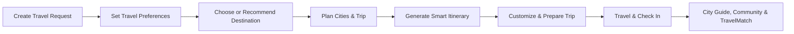
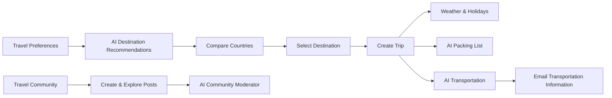

<div align="center">


# SahlDarbak | سهل دربك

### Plan Smarter, Travel Together ✈️

**SahlDarbak** is a smart travel-planning and traveler-matching web platform that helps travelers discover suitable destinations, build personalized trips, and explore their journey with greater confidence.

</div>

---

## Project Brief

**SahlDarbak** is a smart travel platform designed to support travelers before and during their trips.

The platform combines traveler preferences, trip details, artificial intelligence, and external travel data to create a more personalized travel-planning experience.

It helps travelers move from choosing a destination to planning cities and daily activities, preparing for the trip, and exploring their destination after arrival.

SahlDarbak is a **travel planning and assistance platform** and does not provide in-app booking or payment services.

---

## Problem

Planning a trip often requires travelers to use multiple platforms for different needs.

Travelers may need to search separately for destinations, weather, cities, accommodation, restaurants, activities, transportation, budgets, and travel experiences.

This can make travel planning:

- Time-consuming and fragmented.
- Difficult to personalize.
- Harder when planning multiple cities.
- Complicated when considering budget, preferences, or restrictions.
- Less convenient for travelers who want to explore or connect with others after arriving.

---

## Solution

SahlDarbak brings the main stages of the travel journey into one platform.

The system uses traveler preferences, trip information, AI, and external data to help users:

- Discover suitable destinations.
- Build personalized travel plans.
- Organize single-city or multi-city trips.
- Generate and customize daily itineraries.
- Estimate trip expenses and prepare for travel.
- Explore destination-related community experiences.
- Access a location-based city guide after arrival.
- Discover and connect with nearby travelers.
- Receive selected travel information through Email and WhatsApp.

The goal is to reduce the effort required to plan a trip while providing travelers with a more organized and personalized experience.

---

## Main Features

- AI-powered destination recommendations and comparisons.
- Personalized travel planning based on preferences, budget, and travel dates.
- Single-city and multi-city trip planning.
- Smart daily itinerary generation and trip customization.
- Trip budget estimation and travel preparation support.
- Community posts and destination-related travel experiences.
- Location-based city guide after arrival.
- Traveler matching, invitations, and chat.
- Email and WhatsApp support for selected travel information.

---

## Core User Flow



---

## Class Diagram

The following class diagram represents the **17 main entities** in SahlDarbak and their relationships.


## My Contributions

I worked on several of SahlDarbak's core features, focusing on **AI-powered travel assistance, destination discovery, travel preparation, transportation, and the community experience**.

### 🤖 AI Destination Recommendation

```http
GET /api/v1/ai/get/Generated/countries/{travel_request_id}
```

Provides personalized country recommendations based on the user's travel preferences, restrictions, travel dates, and budget.

The feature combines **AI with external travel data** to evaluate potential destinations and provide recommendations that better match the user's requirements.

**AI Model:** Google Gemini Flash Lite  
**External APIs:** OpenWeather API, Nager.Date API

OpenWeather provides weather information for candidate destinations, while Nager.Date provides public-holiday information. These results are combined with the user's preferences to generate personalized recommendations.

---

### 🌍 Select Destination & Create Trip

```http
POST /api/v1/trip/select/{user_id}/{travel_request_id}
```

Allows users to select one of the recommended destinations and create their trip.

This endpoint connects the **AI destination recommendation stage** with the actual trip-planning workflow, carrying the user's travel requirements into their selected destination.

**AI Model:** Not used  
**External APIs:** None

---

### 🌤️ Weather Information

```http
GET /api/v1/trip/weather/{tripId}
```

Retrieves weather information for the user's selected destination.

The weather information helps travelers understand the conditions they can expect during their trip and also supports other travel-assistance features.

**AI Model:** Not used  
**External API:** OpenWeather API

---

### 🎉 Public Holiday Information

```http
GET /api/v1/trip/holidays/{tripId}
```

Retrieves public-holiday information for the user's destination during their travel period.

This helps travelers identify holidays that may affect their trip and consider them when planning their activities and travel dates.

**AI Model:** Not used  
**External API:** Nager.Date API

---

### 🎒 AI Packing List

```http
POST /api/v1/trip/generate-packing-list/{tripId}
```

Generates a personalized packing list using AI based on the user's destination, weather, activities, and trip information.

The generated list is organized into practical categories such as clothing, shoes, weather essentials, activity essentials, travel essentials, and personal care.

**AI Model:** Google Gemini Flash Lite  
**External APIs:** None

---

### 🚗 AI Transportation Recommendation

```http
POST /api/v1/trip/generate-transportation/{tripId}
```

Provides AI-powered transportation recommendations for the places included in the user's trip.

The feature uses real route and location data to determine suitable transportation options, such as walking or public transportation.

**AI Model:** Google Gemini 3.5 Flash Lite  
**External API:** Geoapify API

Geoapify provides route and transportation data, while Gemini analyzes the available options and recommends a suitable transportation method.

---

### 📧 Transportation Information by Email

```http
POST /api/v1/trip/send-transportation-email/{tripId}
```

Allows travelers to send their generated transportation recommendations directly to their email.

This gives users convenient access to their transportation information while traveling.

**AI Model:** Not used  
**External APIs:** None

---

### ⚖️ AI Country Comparison

```http
POST /api/v1/ai/compare-countries
```

Allows users to compare two destinations based on their travel requirements.

The AI evaluates factors such as **weather, activities, environment, crowds, and budget**, then provides a final recommendation and explains why one destination may be more suitable for the traveler.

**AI Model:** Google Gemini Flash Lite  
**External APIs:** OpenWeather API, Nager.Date API

The comparison combines the user's travel-request information with destination data to provide a more personalized recommendation.

---

### 🌎 Travel Community

The Community feature provides a space for travelers to share and explore travel experiences.

Users can:

- Create travel posts
- Browse community posts
- Search posts by country
- View individual posts
- Discover highly-rated travel experiences

The feature adds a social layer to SahlDarbak, allowing travelers to learn from the experiences of other users.

**AI Model:** Not used directly  
**External APIs:** None

**Community Endpoints:**

```http
GET /api/v1/community/get
POST /api/v1/community/post/{user_id}
GET /api/v1/community/country/{country}
GET /api/v1/community/post/{postId}
GET /api/v1/community/get/by/rating
GET /api/v1/community/get/by/name/and/rating/{country}
```

---

### 🛡️ AI Community Moderator

The Community feature is supported by an **AI-powered moderation system** that reviews user-generated content before it is published.

The AI analyzes submitted community content and helps identify inappropriate or unsuitable posts, helping maintain a safer and higher-quality travel community.

**AI Model:** Google Gemini 3.5 Flash Lite  
**External APIs:** None

---

### 💡 Contribution Overview

My work focused on combining **AI, external travel APIs, and user-generated content** to create a more personalized and practical travel experience.

The features I worked on cover multiple stages of the travel journey:



---

---

## Team

| Team Member | Main Area |
|---|---|
| **Razan Almadan** | Discover |
| **Lama Alharbi** | Plan |
| **Mohammed Aljubaili** | Explore |

---

<div align="center">

### SahlDarbak | سهل دربك ✈️

**Plan Smarter, Travel Together**

</div>
