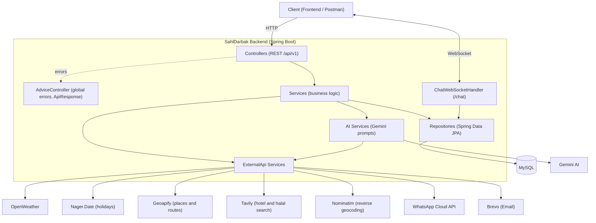
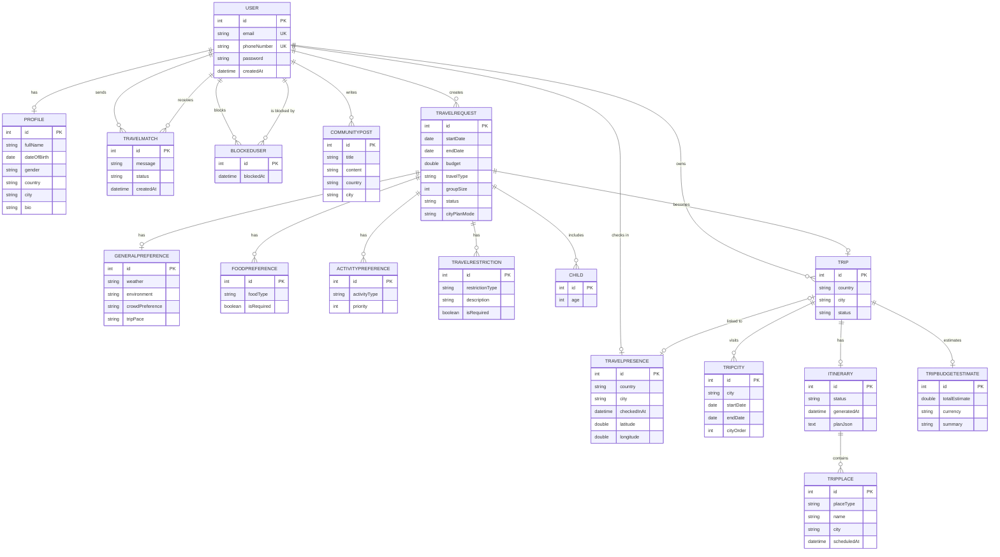

<div align="center">

# SahlDarbak | سهل درب

**Plan Smarter ... Travel Together**

A travel companion backend that helps travelers choose a country, plan the cities and places inside it, and connect with other travelers while on the trip.

</div>

---

## About SahlDarbak

**SahlDarbak** is a travel-planning and traveler-matching system built for every stage of a trip: before you know where to go, while you plan the details, and once you have arrived. It brings AI recommendations, live weather and holiday data, place search, halal verification, WhatsApp, and Email together in one backend.

---

## Table of Contents

- [Problem](#problem)
- [Solution](#solution)
- [System Architecture](#system-architecture)
- [Database Models](#database-models)
- [Flows Overview](#flows-overview)
- [Flow 1: Discover](#flow-1-discover-i-dont-know-which-country)
- [Flow 2: Plan](#flow-2-plan-i-dont-know-the-cities-and-places)
- [Flow 3: On the Trip](#flow-3-on-the-trip-im-already-in-the-city)
- [Project Structure](#project-structure)
- [Running the Project](#running-the-project)
- [Team](#team)

---

## Problem

Planning a trip usually means juggling many sources, and traveling alone can feel isolated.

This creates practical problems such as:

- Not knowing which country fits your interests, season, and budget.
- Missing weather conditions or public holidays at the destination.
- Not knowing which cities to visit, or how many days each deserves.
- Building an itinerary by hand, with no check on hotels or halal food.
- Unclear transport between places.
- Forgetting important items to pack, such as warm clothes or medication.
- Having no easy way to meet other travelers who are in the same city.

---

## Solution

SahlDarbak guides the traveler through the whole journey, depending on what they already know.

The system allows travelers to:

- Get AI-recommended countries based on interests, weather, and holidays.
- Compare two countries and see which fits better.
- Let AI split a trip across cities and days.
- Generate a daily itinerary with hotels, restaurants, and halal verification.
- Get the best transport option between planned places.
- Estimate the trip budget.
- Receive a personalized packing list.
- Publish and browse community posts about trips and countries.
- Check in to a city and get a local guide.
- Find nearby travelers, send invites, and chat after acceptance.
- Block unwanted users.
- Receive notifications through WhatsApp and Email.

---

## System Architecture

SahlDarbak is a layered **Spring Boot** application. Controllers receive requests, services hold the business logic, repositories talk to MySQL, and AI and external-API services reach out to third-party providers. Errors from any layer are returned in one format by a global exception handler.



**Layers**

| Layer | Package | Role |
|-------|---------|------|
| Controller | `Controller`, `AI` (AIController) | REST endpoints under `/api/v1`. |
| Service | `Service` | Business rules for each feature. |
| AI | `AI` | Builds prompts, calls Gemini, parses JSON into DTOs. |
| External API | `ExternalApi` | One client class per third-party provider. |
| Repository | `Repository` | JPA data access to MySQL. |
| Chat | `Chat` | WebSocket handler and config. |
| DTO / Api / Advice | `DTO`, `Api`, `Advice` | Request and response shapes, `ApiResponse`, `ApiException`, global error handling. |

---

## Database Models

17 entities. A `User` owns a profile, a live location (`TravelPresence`), travel requests, trips, community posts, and the invite and block relations. A `TravelRequest` holds the traveler's preferences and becomes a `Trip`, which holds cities, an itinerary, places, and a budget estimate.



---

## Flows Overview

SahlDarbak is organized around **what the traveler already knows**. Each flow below is written by the developer who built it.

| Flow | Traveler's situation | What it does |
|------|----------------------|--------------|
| **1. Discover** | "I don't know which country." | AI suggests and compares countries using interests, weather, and holidays. Also covers packing list, transportation, and community posts. |
| **2. Plan** | "I picked a country, but not the cities and places." | AI chooses cities and splits days, builds the itinerary with hotels, restaurants and halal checks, estimates the budget, and emails the plan. |
| **3. On the Trip** | "I'm already in a city." | Check-in, city guide, nearby travelers, invites, block, WhatsApp notifications, and in-site chat. |

---

## Flow 1: Discover (I don't know which country)

> Owner: _TBD_

_Goal, Steps, Endpoints, Business Rules, AI / External APIs used._

---

## Flow 2: Plan (I don't know the cities and places)

> Owner: _TBD_

_Goal, Steps, Endpoints, Business Rules, AI / External APIs used._

---

## Flow 3: On the Trip (I'm already in the city)

> Owner: Mohammed

_Goal, Steps, Endpoints, Business Rules, AI / External APIs used._

---

## Project Structure

```text
com.example.sahldarbak
├── Advice          # global exception handling
├── AI              # Gemini-powered services and AIController
├── Api             # ApiResponse, ApiException
├── Chat            # WebSocket handler and config
├── Controller      # REST controllers
├── DTO             # request/response objects
├── ExternalApi     # third-party API clients
├── Model           # JPA entities
├── Repository      # Spring Data repositories
├── Service         # business logic
└── SahlDarbakApplication.java
```

---

## Running the Project

**Requirements:** Java 17, Maven, MySQL.

1. Create the database `SahlDarbak` and set the connection in `application.properties`.
2. Set these environment variables (never commit real values):

| Variable | Used for |
|----------|----------|
| `GEMINI_API_KEY` | Gemini AI |
| `OPENWEATHER_API_KEY` | Weather |
| `GEOAPIFY_API_KEY` | Places and routes |
| `TAVILY_API_KEY` | Hotel and halal search |
| `BREVO_API_KEY` | Email |
| `WHATSAPP_PHONE_NUMBER_ID` | WhatsApp |
| `WHATSAPP_ACCESS_TOKEN` | WhatsApp (temporary tokens expire every 24 hours) |

3. Run the app:

```bash
mvn spring-boot:run
```

The API is available at `http://localhost:8080/api/v1`.

---

## Team

| Name | Flow |
|------|------|
| Mohammed Turki | Flow 3: On the Trip |
| _TBD_ | Flow 1: Discover |
| _TBD_ | Flow 2: Plan |
