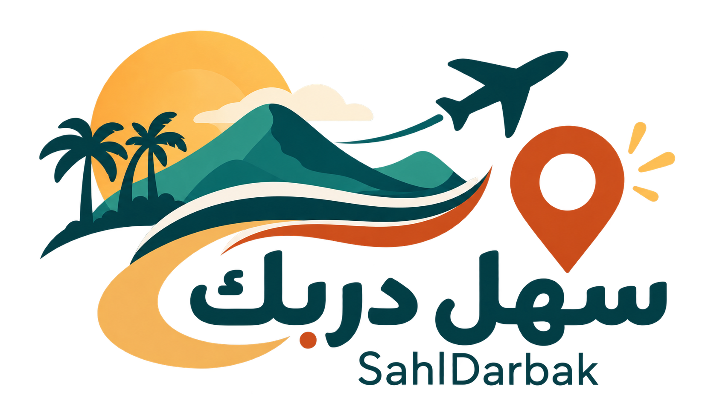
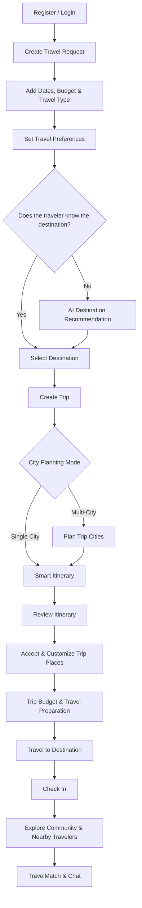
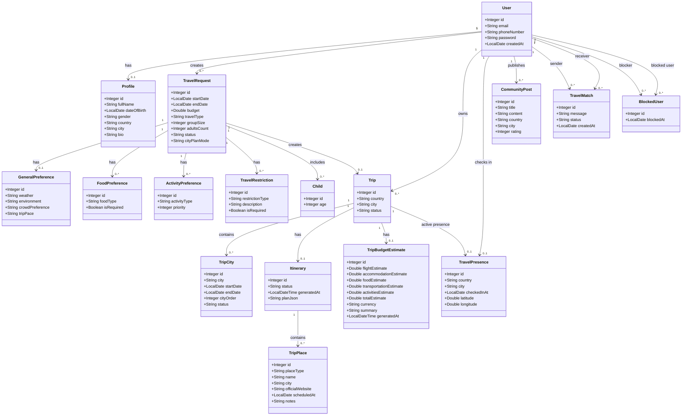

# SahlDarbak | سهل دربك

### Plan Smarter, Travel Together ✈️

**SahlDarbak** is a smart travel-planning and traveler-matching web platform that helps travelers discover suitable destinations, build personalized trips, and connect with other travelers throughout their journey.

---

## About SahlDarbak

Planning a trip often requires travelers to move between multiple platforms to search for destinations, cities, hotels, restaurants, activities, transportation, weather, and other travel information.

**SahlDarbak** brings these needs together into one personalized travel-planning experience.

The platform considers the traveler's preferences, budget, travel dates, travel style, food preferences, and restrictions to provide recommendations and organize the trip from the early planning stage until the traveler arrives at the destination.

SahlDarbak is a **travel planning and assistance platform**. It does not provide in-app booking or payment services.

---

## Problem

Travel planning can be time-consuming and fragmented.

Travelers often face challenges such as:

- Searching across multiple platforms for travel information.
- Deciding which destination best matches their interests, budget, and travel dates.
- Choosing which cities to visit during a multi-city trip.
- Finding suitable hotels, restaurants, and activities.
- Considering food preferences and travel restrictions.
- Manually organizing activities into a daily itinerary.
- Estimating the overall cost of a trip.
- Preparing for weather conditions and public holidays.
- Choosing suitable transportation between planned places.
- Knowing what to pack for the trip.
- Finding other travelers with similar interests while abroad.

---

## Solution

SahlDarbak provides one smart platform that supports travelers throughout the travel-planning journey.

The platform combines traveler preferences, trip details, artificial intelligence, and external travel data to create a more personalized and organized experience.

SahlDarbak helps travelers:

- Discover destinations that match their preferences.
- Compare destination options.
- Plan single-city and multi-city trips.
- Generate personalized daily itineraries.
- Discover hotels, restaurants, activities, and other places.
- Access halal-related restaurant information.
- Customize an accepted trip plan.
- Estimate trip expenses.
- Check weather and holiday information.
- Receive packing and transportation suggestions.
- Share selected travel information through Email and WhatsApp.
- Publish and explore travel experiences through the community.
- Check in while traveling.
- Discover nearby travelers with similar interests.
- Send and manage traveler match invitations.
- Chat with accepted travel matches.
- Block unwanted users.

The goal of SahlDarbak is to reduce the time and effort required to plan a trip while giving travelers more control over a personalized travel experience.

---

## Main Features

### Smart Destination Discovery
Uses traveler preferences, trip dates, budget, weather, and other travel information to help recommend suitable destinations.

### Personalized Travel Preferences
Travelers can define their preferred:

- Weather
- Environment
- Trip pace
- Crowd level
- Food preferences
- Activities
- Travel restrictions
- Travel type

### Single-City & Multi-City Planning
Travelers can plan a trip to one city or organize multiple cities across their travel dates.

### Smart Itinerary
Creates a personalized daily itinerary containing suggested places, restaurants, hotels, and activities.

### Trip Customization
After accepting an itinerary, travelers can add, update, or remove places from their trip plan.

### Budget Estimation
Provides an estimated trip budget covering major travel expense categories.

### Travel Preparation
Supports travelers with useful information such as:

- Weather
- Public holidays
- Packing suggestions
- Transportation suggestions

### Community
Travelers can publish and browse travel experiences and recommendations.

### Traveler Matching
Travelers can check in to their current destination and discover nearby travelers.

### Communication
The platform supports Email, WhatsApp, and in-site chat for selected travel features.

---

## Core User Flow

---

# Class Diagram

The following diagram represents the **17 main entities** in SahlDarbak and their relationships.

---

## Team

| Team Member | Main Area |
|---|---|
| **Razan Almadan** | Discover |
| **Lama Alharbi** | Plan |
| **Mohammed Aljubaili** | Explore |

---

### SahlDarbak | سهل دربك ✈️

**Plan Smarter, Travel Together**

