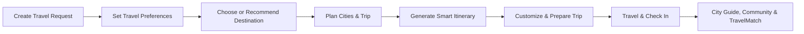
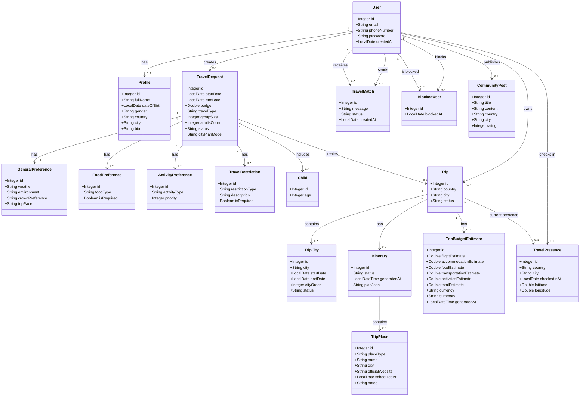

# SahlDarbak | سهل دربك

### Plan Smarter, Travel Together ✈️

**SahlDarbak** is a smart travel-planning and traveler-matching web platform that helps travelers discover suitable destinations, build personalized trips, and explore their journey with greater confidence.

---

## Project Brief

**SahlDarbak** is a smart travel platform designed to support travelers before and during their trips.

The platform combines traveler preferences, trip details, artificial intelligence, and external travel data to create a more personalized travel-planning experience.

It helps travelers move from choosing a destination to planning cities and daily activities, preparing for the trip, and exploring their destination after arrival.

SahlDarbak is a **travel planning and assistance platform** and does not provide in-app booking or payment services.

---

## Problem

Planning a trip often requires travelers to use multiple platforms for different needs.

Travelers may need to search separately for destinations, weather, cities, accommodation, restaurants, activities, transportation, budgets, and travel experiences.

This can make travel planning:

- Time-consuming and fragmented.
- Difficult to personalize.
- Harder when planning multiple cities.
- Complicated when considering budget, preferences, or restrictions.
- Less convenient for travelers who want to explore or connect with others after arriving.

---

## Solution

SahlDarbak brings the main stages of the travel journey into one platform.

The system uses traveler preferences, trip information, AI, and external data to help users:

- Discover suitable destinations.
- Build personalized travel plans.
- Organize single-city or multi-city trips.
- Generate and customize daily itineraries.
- Estimate trip expenses and prepare for travel.
- Explore destination-related community experiences.
- Access a location-based city guide after arrival.
- Discover and connect with nearby travelers.
- Receive selected travel information through Email and WhatsApp.

The goal is to reduce the effort required to plan a trip while providing travelers with a more organized and personalized experience.

---

## Main Features

- AI-powered destination recommendations and comparisons.
- Personalized travel planning based on preferences, budget, and travel dates.
- Single-city and multi-city trip planning.
- Smart daily itinerary generation and trip customization.
- Trip budget estimation and travel preparation support.
- Community posts and destination-related travel experiences.
- Location-based city guide after arrival.
- Traveler matching, invitations, and chat.
- Email and WhatsApp support for selected travel information.

---

## Core User Flow

---

## Class Diagram

The following class diagram represents the **17 main entities** in SahlDarbak and their relationships.

---

## Team

| Team Member | Main Area |
|---|---|
| **Razan Almadan** | Discover |
| **Lama Alharbi** | Plan |
| **Mohammed Aljubaili** | Explore |

---

### SahlDarbak | سهل دربك ✈️

**Plan Smarter, Travel Together**

